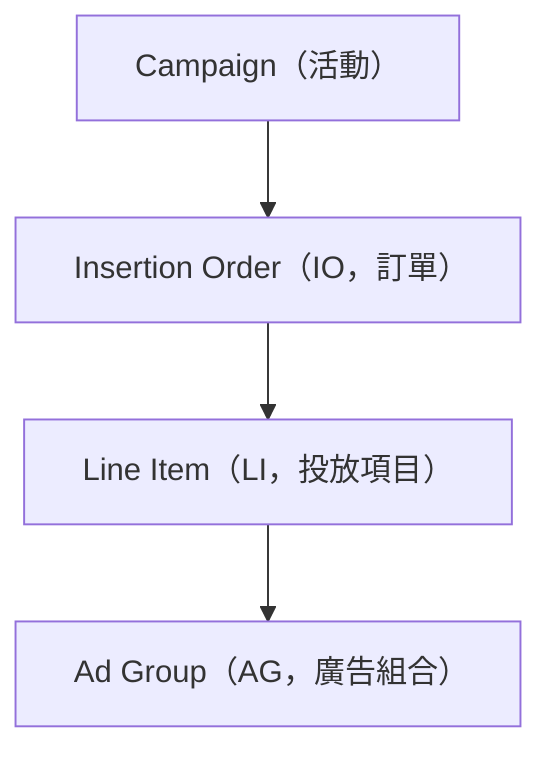
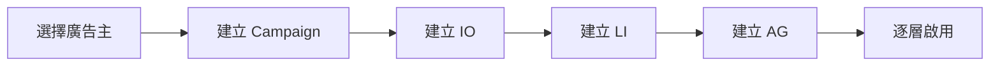

# SuperDSP 2.0 Phase 0 — AOE 操作手冊

## 開場

### 這份文件是什麼

SuperDSP 2.0 Phase 0 是即將取代 ODM 的新代操平台，目前正在進行 demo。本手冊協助你快速掌握新系統的操作模式，並以你熟悉的 ODM 操作作為參考點。

### Phase 0 的範圍

Phase 0 只涵蓋**廣告核心操作**：Campaign（活動）、IO（訂單）、LI（投放項目）、AG（廣告組合）四層的建立、編輯、啟用、暫停、結束。以下功能**尚未包含**：

- 排 Cue、拋轉
- 帳號架構（組織 / 工作區 / 廣告主）
- 素材管理（素材包建立、上傳、審核）
- OnePixel 追蹤碼
- 受眾資料（CRM、再行銷）
- 報表、批次操作、審批流程

這些功能會在後續版本補上。Phase 0 僅供 AOE 內部使用，外部客戶尚不會看到。

### 如何閱讀

- 手冊採「建立流程 → 填寫規則 → 操作情境 → 附錄速查」順序編排
- 第一次操作建議照順序讀到「操作情境」；欄位細節、ODM 對照可直接翻附錄查詢
- 與 ODM 行為不同的地方會以「🔄 與 ODM 差異」區塊標出

---

## 架構總覽

Phase 0 四層架構：



| 層級                        | 定位                              | 你在這層做的事                                               |
| --------------------------- | --------------------------------- | ------------------------------------------------------------ |
| Campaign                    | 活動總框架                        | 設定活動名稱、總預算規模（參考用）、整體走期                 |
| IO（Insertion Order，訂單） | 行銷目標單位，對應原排 Cue        | 設定本批投放的行銷目標與實際預算                             |
| LI（Line Item，投放項目）   | 投放策略單位，對應 ODM 的投放項目 | 選擇產品類別、格式、出價方式、定向設定                       |
| AG（Ad Group，廣告組合）    | 素材執行單位                      | 指派素材包、分配預算、決定是否啟用 Smart Boost（ODM pacing） |

> 🔄 **與 ODM 差異**：獨立出 AG 層，負責管控素材。

---

## 建立流程

建立新投放活動依序走六個步驟：



每一層的建立都是獨立的設定頁面。填完必填欄位後儲存，該層進入**草稿**狀態，並且回到列表頁。

### 主案例

本手冊用「**某電商雙 11 檔期**」貫穿全文，各章節數字均以這份案例為準：

```
Campaign「某電商雙 11 檔期」
├─ 預算：150 萬（參考用）
├─ 走期：2026-10-24 ~ 2026-11-06（14 天）
│
├─ IO-A 預熱（brandBuilding，40 萬，10/24–10/31）
│   ├─ LI-1 RichMedia（20 萬）→ AG-1（20 萬）
│   └─ LI-2 InStream（20 萬）  → AG-2（20 萬）
│
└─ IO-B 主打（brandBuilding，110 萬，11/01–11/06）
    ├─ LI-3 RichMedia（60 萬）→ AG-3（60 萬）
    └─ LI-4 InStream（50 萬）  → AG-4（50 萬）
```

---

### Step 1：選擇廣告主

進入目標廣告主帳號後才能進行後續操作。帳號架構不在本手冊範圍，你直接使用既有廣告主即可。

### Step 2：建立 Campaign

Campaign 是最上層。只有**活動名稱**為必填，總預算與走期均為選填，不填也不影響下層操作。（欄位說明見附錄 A）

儲存後進入**草稿**狀態。

**主案例：** 名稱填「某電商雙 11 檔期」，預算 150 萬，走期 2026-10-24 ~ 2026-11-06。

### Step 3：在 Campaign 下建立 IO

IO 設定行銷目標與預算。（欄位說明見附錄 A）

建立前需先選定行銷目標——它決定了底下 LI 可選的產品類別，**建立後不可變更**。若目標選錯，請新建一個 IO。

| 值               | 用途          | 對應 LI 可選產品類別 |
| ---------------- | ------------- | -------------------- |
| `brandBuilding`  | 品牌力建立    | RichMedia / InStream |
| `driveTraffic`   | 網站/App 導流 | Quality Traffic      |
| `pushConversion` | 轉換推動      | Commerce Ad          |
| `others`         | 不設行銷目標  | 全部開放             |

設定 pacing（原投放策略）

| 值            | 用途           |
| ------------- | -------------- |
| `ASAP`        | 盡可能快速投完 |
| `Hourly Even` | 每小時平均     |

**主案例：** 建立 IO-A「預熱」（`brandBuilding`、40 萬、10/24–10/31）與 IO-B「主打」（`brandBuilding`、110 萬、11/01–11/06）。

> 🔄 **與 ODM 差異**：ODM 沒有行銷目標，而是透過產品線決定可選廣告格式。新系統在 IO 層新增此設定並提供「不設行銷目標」選項以對應不符合前三類的活動，可選廣告格式全開。

### Step 4：在 IO 下建立 LI

LI 設定產品類別、廣告格式、出價與品牌全與定向。（欄位說明見附錄 A）

以下欄位儲存後不可修改，若需調整只能新建 LI：

| 欄位     | 鎖定時機                   |
| -------- | -------------------------- |
| 產品類別 | 儲存後不可修改             |
| 廣告格式 | 儲存後不可修改             |
| 投放類型 | 儲存後不可修改             |
| 出價方式 | 草稿階段可修改，啟用後鎖定 |

**主案例：** 在 IO-A 下建立 LI-1（RichMedia，20 萬）與 LI-2（InStream，20 萬）。在 IO-B 下建立 LI-3（RichMedia，60 萬）與 LI-4（InStream，50 萬）。

> 🔄 **與 ODM 差異**：LI 層需要手動填寫產品線，並且在正式投放前可以修改，避免產品線選錯或是出現需要等 **Media PM** 先設定好產品線才能繼續設定 LI 的困擾。

#### 定向複製

- Phase 0 先採用定向複製的功能，不做定向模版（如 DV360）。

#### 品牌安全

- 未來品牌安全將會在 Advertiser 層設定，在建立 LI 的品牌安全只能收窄。

### Step 5：在 LI 下建立 AG

AG 指派素材、分配預算。（欄位說明見附錄 A）

建立前注意：

- 素材包必須已取得「已核准」狀態才能指派，且格式必須與 LI 的廣告格式相容
- 若素材平台暫時無法連線，系統會顯示錯誤並阻止 AG 建立，請等連線恢復後再操作
- 所有 AG 預算加總不得超過 LI 預算

**主案例：** 為每個 LI 建立一個 AG，預算與 LI 相等，各自指派 1–2 個已核准的素材包。

> 🔄 **與 ODM 差異**：AG 可以獨立安排預算、走期和綁定多個素材包，也可以設定 Smart Boost（原 pacing）。

### Step 6：逐層啟用

完成建立後，所有層級均為**草稿**狀態，尚未開始投放。你需要**從上到下逐層**將各層切換為啟用中。

啟用規則：

- 父層必須先啟用，才能啟用子層
- 每層啟用前都有檢查條件，見下表

| 層級     | 啟用前必須滿足的條件                                                                    |
| -------- | --------------------------------------------------------------------------------------- |
| Campaign | 底下至少有一個 IO                                                                       |
| IO       | 所屬 Campaign 已啟用；底下至少有一個 LI；所有 LI 預算加總 ≤ IO 預算                     |
| LI       | 所屬 IO 已啟用；底下至少有一個 AG；所有 AG 預算加總 ≤ LI 預算                           |
| AG       | 所屬 LI 已啟用；所有素材包均為「已核准」且格式與 LI 廣告格式相容；AG 預算加總 ≤ LI 預算 |

通過檢查，狀態切換為**啟用中**，開始投放。若檢查未通過，畫面會顯示錯誤清單，請依清單修正後再重試。

> 🔄 **與 ODM 差異**：Phase 0 為**逐層啟用**，無法一次啟用整個活動。一鍵啟用整個活動的功能將於 Phase 1 提供。

---

## 填寫規則

### 預算

從 IO 層開始，下層所有預算加總不得超過父層預算。

| 層級     | 必填 | 是否限制下層            |
| -------- | ---- | ----------------------- |
| Campaign | 選填 | 不限制（僅供參考）      |
| IO       | 必填 | 是（所有 LI 加總 ≤ IO） |
| LI       | 必填 | 是（所有 AG 加總 ≤ LI） |
| AG       | 必填 | —                       |

**什麼情況下會被擋住：**

- 新建或修改子層，且加總超過父層預算 → 無法儲存
- 調低父層預算，且新金額低於現有子層加總 → 無法儲存，請先調低子層
- 修改任何層的預算，且新金額低於該層已花費金額 → 無法儲存

預算必須是**大於 0 的整數**（元），幣別固定為新台幣。出價金額可填至小數第二位。

**主案例示範：**

```
Campaign 150 萬（參考用，不限制下層）
├─ IO-A 40 萬
│   ├─ LI-1 20 萬  ✅
│   └─ LI-2 20 萬  ✅（20 + 20 = 40，等於 IO-A 預算）
└─ IO-B 110 萬
    ├─ LI-3 60 萬  ✅
    └─ LI-4 50 萬  ✅（60 + 50 = 110，等於 IO-B 預算）
```

若將 LI-2 改為 25 萬，系統會擋住：20 + 25 = 45 萬，超過 IO-A 的 40 萬。此時需先調低 LI-1，或先將 IO-A 預算上調。

> 🔄 **與 ODM 差異**：ODM 無法跨層級細分預算，新系統支援 IO → LI → AG 逐層分配，讓每一層的預算使用都清晰可控。

---

### 走期

走期以**日為單位**，不含時分秒，固定使用台灣時間。

| 層級     | 必填 | 不填時的行為                                 |
| -------- | ---- | -------------------------------------------- |
| Campaign | 選填 | 底下的 IO 走期不受 Campaign 走期限制         |
| IO       | 必填 | —                                            |
| LI       | 必填 | —                                            |
| AG       | 選填 | 沿用 LI 走期（開始與結束日期需同時填或不填） |

**填寫限制：**

- 子層走期必須完全落在父層走期範圍內（父層有填走期才檢查）
- 縮短父層走期時，若新走期無法涵蓋某子層，系統會擋住儲存
- 允許單日投放（開始日期與結束日期填同一天）
- 新建時，開始日期不能早於今天
- 修改時，若開始日期已過，不再做日期檢查（避免阻擋修改進行中投放的其他設定）

**主案例示範：**

```
Campaign  2026-10-24 ─────────────────── 2026-11-06
IO-A 預熱 2026-10-24 ───── 2026-10-31
IO-B 主打                  2026-11-01 ── 2026-11-06
LI-1~4    落在對應 IO 走期內
AG-1~4    不填，沿用 LI 走期
```

---

## 定向設定

所有定向設定**統一在 LI 層**操作。IO 層與 AG 層不支援定向設定。

### 定向類型

#### 環境定向

| 類型     | 說明                                                   |
| -------- | ------------------------------------------------------ |
| 地理定向 | 國家、區域、城市                                       |
| 裝置     | Desktop / Mobile / Tablet / CTV                        |
| 作業系統 | Windows / macOS / iOS / Android                        |
| 投放時段 | 設定哪些時段要投放                                     |
| 頻次上限 | 每位用戶最多看幾次，可設時間窗口（每日 / 每週 / 總計） |

#### 品牌安全

| 類型     | 說明                                                                |
| -------- | ------------------------------------------------------------------- |
| 品牌安全 | 透過 IAS 整合，可排除特定內容類別或設定風險等級。只能收窄，不能放寬 |

#### 媒體與內容

| 類型     | 說明                         |
| -------- | ---------------------------- |
| 媒體池   | 加入或排除特定媒體、媒體群組 |
| 內容定向 | 依內容分類投放               |

#### 受眾

| 類型     | 說明                                                                                                  |
| -------- | ----------------------------------------------------------------------------------------------------- |
| 受眾定向 | 興趣、人口統計、自訂受眾、Lookalike、Retargeting、CRM 名單、OnePixel 行為受眾、Diamond、Shopper Graph |

### 定向複製

Phase 0 提供從現有 LI 複製定向設定到新 LI 的功能。

> 🔄 **與 ODM 差異**：新系統**統一在 LI 層**操作定向設定。未來廣告主層上線後，品牌安全會改為在廣告主層設定基準，LI 層只能在基準上進一步收窄。

---

## 操作情境

以下用常見情境說明你會遇到的操作與結果。

### 狀態操作

每一層（Campaign、IO、LI、AG）都有四種狀態：**草稿、啟用中、暫停、已結束**。

---

**情境 1：剛建立完，想開始投放**

新建的每一層預設都是**草稿**，不會投放。你需要從 Campaign 開始，逐層點擊啟用，各層通過條件檢查後即切換為**啟用中**。

---

**情境 2：活動要暫時停播**

在任一層點擊暫停，該層及底下所有子層立刻停止投放。**子層各自的狀態設定不會被改動**。

恢復時只需把那一層切回啟用中，子層會自動回到各自原本的狀態——原本啟用中的繼續投放、原本暫停的維持暫停，不需要逐一手動恢復。

> 🔄 **與 ODM 差異**：新系統暫停父層不會更動子層的狀態，恢復時子層自動回到原本設定，無需手動逐一操作。

---

**情境 3：想刪掉一個設定錯誤的層級**

只有**草稿**狀態可以刪除。已經啟用過的層級無法刪除，只能結束。刪除後**無法還原**，操作前畫面會顯示提示。

---

**情境 4：活動已結束，想延續投放**

已結束的層級是**終態**，無法重新啟用。若需要延續投放，請新建一份並複製原本的設定。

---

**情境 5：走期到期**

任一層的結束日期到期，該層自動切換為**已結束**，底下所有子層也同步結束。

---

**情境 6：所有訂單都結束了**

當 Campaign 底下所有 IO 都已結束，Campaign 會**自動切換為已結束**。

IO 和 LI 不適用此規則——即使一個 IO 底下所有 LI 都已結束，你仍可在該 IO 下新建 LI，畫面會顯示提示但不會阻擋你操作。

---

### 預算調整

**情境 7：想調高某層的預算**

直接修改該層預算欄位儲存即可。上調不受限制（Campaign 預算僅供參考，對下層無實際限制）。

---

**情境 8：想調低某層的預算，但被系統擋住**

調低預算時，新金額不能低於底下子層的預算加總，也不能低於該層已花費的金額。

被擋住時的做法：先進入子層，逐一調低各子層預算，再回頭調整上層。

---

**情境 9：想把 IO 預算重新分配給不同 LI**

直接修改各 LI 的預算即可，任何時間點所有 LI 加總不得超過 IO 預算。

若想把預算從 LI-1 移給 LI-2（例如 LI-1：30 萬 → 20 萬，LI-2：20 萬 → 30 萬），需**先調低 LI-1，再調高 LI-2**，避免加總瞬間超標被系統擋住。

---

### 設定修改

**情境 10：想改已啟用 LI 的出價金額**

出價金額啟用後可修改。出價方式（cpm / cpc / cpv）啟用後鎖定，無法變更。若需調整出價方式，請新建 LI。

---

**情境 11：發現 LI 的產品類別選錯了**

產品類別、廣告格式、投放類型一旦儲存即不可修改。唯一解法是新建一個 LI 填入正確設定。

原本錯誤的 LI：若是草稿可直接刪除；若已啟用過，只能結束，無法刪除。

---

**情境 12：想把一個 LI 的定向複製到另一個 LI**

建立新 LI 時，定向設定步驟提供「從現有 LI 複製」功能。選擇來源 LI 後，全部定向設定會帶入新 LI，之後可個別調整。

---

### 建立過程中的狀況

**情境 13：點擊啟用後，系統顯示錯誤清單**

畫面會列出所有未通過的條件（例如：底下沒有子層、預算加總超標、素材包未核准）。依清單逐項修正後，再重新點擊啟用。不需要重填表單，只修正被標示的問題即可。

---

**情境 14：素材包不是「已核准」狀態，AG 建不起來**

AG 建立時，素材平台的連線狀態與素材核准狀態都會即時檢查：

- **素材未核准**：至素材管理平台確認核准流程，核准後回來重試。
- **素材平台無法連線**：等連線恢復後再操作，系統不會在連線異常時允許 AG 建立。

---

### 跨層操作

**情境 15：投放進行中，想在 Campaign 下新增 IO**

可以直接在 Campaign 詳細頁新增 IO，不需要暫停現有投放。新 IO 建立後為草稿，完成設定並逐層啟用後才開始投放。現有的 IO 不受影響。

---

**情境 16：走期快到了，想延長**

進入該層修改結束日期儲存即可，延長不受限制。若同時想縮短走期，須確認子層走期仍落在新範圍內，否則系統會擋住儲存。

---

## 附錄 A：各層欄位說明

### Campaign 欄位

| 欄位     | 必填 | 說明                             |
| -------- | ---- | -------------------------------- |
| 活動名稱 | ✓    | 自訂活動名稱                     |
| 總預算   | –    | 總預算上限（參考用，不阻擋下層） |
| 開始日期 | –    | 活動起始日                       |
| 結束日期 | –    | 活動結束日                       |

### IO 欄位

| 欄位     | 必填 | 說明                  |
| -------- | ---- | --------------------- |
| IO 名稱  | ✓    | 自訂名稱              |
| 行銷目標 | ✓    | 見建立流程 Step 3     |
| 預算     | ✓    | IO 預算（> 0 正整數） |
| 起訖日期 | ✓    | 投放起始日與結束日    |
| 投放節奏 | ✓    | Hourly Even / ASAP    |

### LI 欄位

| 欄位         | 必填 | 說明                                                 |
| ------------ | ---- | ---------------------------------------------------- |
| LI 名稱      | ✓    | 自訂名稱                                             |
| 產品類別     | ✓    | RichMedia / InStream / Quality Traffic / Commerce Ad |
| 廣告格式     | ✓    | 依廣告主合約、產品類別、IO 行銷目標篩選出可選清單    |
| 投放類型     | ✓    | direct / rtb / speed                                 |
| 出價方式     | ✓    | cpm / cpc / cpv                                      |
| 出價金額     | ✓    | 新台幣，可填至小數第二位                             |
| 預算         | ✓    | LI 預算（> 0 正整數）                                |
| 起訖日期     | ✓    | 投放起始日與結束日                                   |
| 產品線       | ✓    | 內部財務歸屬用                                       |
| 業績歸屬業務 | ✓    | 負責此投放的業務                                     |
| 定向設定     | –    | 見「定向設定」章節                                   |

### AG 欄位

| 欄位        | 必填 | 說明                                           |
| ----------- | ---- | ---------------------------------------------- |
| AG 名稱     | ✓    | 自訂名稱                                       |
| 素材包      | ✓    | 至少一個，且素材包狀態必須為「已核准」         |
| 預算        | ✓    | AG 預算（> 0 正整數）                          |
| 起訖日期    | –    | 不填則沿用 LI 走期（開始與結束日期需同時填寫） |
| Smart Boost | –    | 是否啟用，及啟用後的比例（0–100%）             |

#### Smart Boost 說明

啟用後需填入一個比例值（0–100%）。系統會以「AG 預算 × 比例」將這部分預算自動分配給高成效、低成本的媒體版位進行投放。

---

## 附錄 B：與 ODM 差異速查表

| 項目              | ODM                                                 | SuperDSP 2.0 Phase 0                                                      |
| ----------------- | --------------------------------------------------- | ------------------------------------------------------------------------- |
| AG 層             | 無獨立 AG 層，素材直接綁投放項目                    | 新增 AG 層，可綁多素材包、獨立預算走期、設定 Smart Boost                  |
| IO / LI / AG 預算 | 無法跨層級細分預算                                  | 必填、大於 0，支援 IO → LI → AG 逐層分配                                  |
| AG 走期           | —                                                   | 選填，不填則沿用 LI 走期（起訖需同時填寫）                                |
| 行銷目標設定位置  | —                                                   | IO 層，新增「不設行銷目標」選項                                           |
| 廣告格式          | 產品線由 Media PM 設定，AOE 需等設定完才能繼續填 LI | 廣告格式、產品線、業績歸屬業務各自獨立必填，AOE 直接填寫，不需等 Media PM |
| 定向設定          | 在 campaign 層                                      | 統一在 LI 層                                                              |
| 父層暫停          | —                                                   | 子層狀態不變，父層恢復後子層自動回到原本設定                              |
| 啟用方式          | —                                                   | 逐層啟用                                                                  |
| Smart Boost       | 欄位名稱為 Pacing                                   | 欄位改名為 Smart Boost，語意相同                                          |

---

## 變更紀錄

| 日期       | 變更內容                                                                                                          |
| ---------- | ----------------------------------------------------------------------------------------------------------------- |
| 2026-04-27 | 操作情境移至填寫規則與定向設定之後；新增情境 7–16（預算調整、設定修改、建立狀況、跨層操作）；加入狀態操作分組標題 |
| 2026-04-27 | 改為「建立流程 → 填寫規則 → 附錄速查」結構；欄位表格移至附錄 A，流程段聚焦操作步驟與決策提示                      |
| 2026-04-27 | 全面改寫為操作導向用語                                                                                            |
| 2026-04-24 | 初版，依據《SuperDSP 2.0 Phase 0 — 廣告層級核心規格》第八版轉譯產出                                               |
